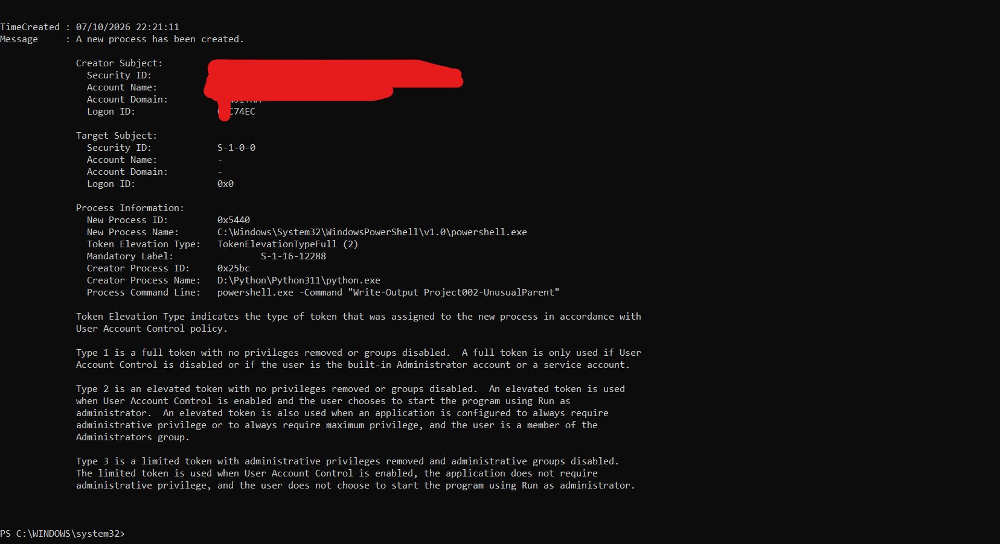

# Detection Research 002 — Suspicious PowerShell Parent Process

## Goal

The goal of this project is to investigate whether the process that starts PowerShell can help identify PowerShell activity that deserves investigation.

PowerShell is commonly used for legitimate administration and automation, so the presence of `powershell.exe` alone does not mean something is malicious.

The process that starts PowerShell provides additional context.

For example:

```text
cmd.exe
    ↓
powershell.exe
```

may occur during normal command-line activity.

Other parent-child relationships may deserve more investigation, depending on the environment and what PowerShell does next.

---

## Detection Idea

My detection looks for:

```text
powershell.exe
      +
selected parent process
      ↓
flag for investigation
```

The selected parent processes in this detection are:

- `python.exe`
- `WINWORD.EXE`
- `EXCEL.EXE`
- `wscript.exe`
- `cscript.exe`
- `mshta.exe`

A match does not mean that malicious activity has occurred.

The purpose of the detection is to identify PowerShell activity that may need additional investigation.

---

## How I Tested It

I used Python to create a controlled parent-child process relationship:

```text
python.exe
    ↓
powershell.exe
```

Python started PowerShell and executed the following harmless command:

`Write-Output Project002-UnusualParent`

I then checked Windows Security Event ID 4688 to see how Windows recorded the process creation.

---

## What I Observed

Windows Event 4688 recorded the following information:

```text
New Process Name:
powershell.exe

Creator Process Name:
python.exe

Process Command Line:
powershell.exe -Command "Write-Output Project002-UnusualParent"
```

This showed that the process creation telemetry could tell me:

- The process that was created
- The process that started it
- The command used to start the new process

### Evidence

The following screenshot shows the Windows Event 4688 generated during my controlled test:



The event shows `python.exe` as the creator process and `powershell.exe` as the new process.

---

## How the Detection Changed

My first version of the detection only looked for:

```text
python.exe
    ↓
powershell.exe
```

While reviewing the detection, I realised this was too narrow.

Python was useful for creating a safe test, but it is not the only process that may be interesting when it starts PowerShell.

I therefore expanded the detection to include several selected parent processes:

```text
python.exe
WINWORD.EXE
EXCEL.EXE
wscript.exe
cscript.exe
mshta.exe
        ↓
powershell.exe
```

The parent-child relationship is still only a signal for investigation. It does not prove malicious activity.

---

## Detection Files

The same detection idea is written in three formats.

### Splunk SPL

[`suspicious_powershell_parent.spl`](detections/suspicious_powershell_parent.spl)

SPL (Search Processing Language) is the query language used by Splunk.

This file searches process telemetry for `powershell.exe` where the parent process matches one of the selected parent processes.

It also displays useful investigation fields such as the user, parent process, child process and command line.

### Microsoft KQL

[`suspicious_powershell_parent.kql`](detections/suspicious_powershell_parent.kql)

KQL (Kusto Query Language) is used by Microsoft security products such as Microsoft Sentinel and Microsoft Defender XDR.

This file searches `DeviceProcessEvents` for PowerShell processes where `InitiatingProcessFileName` matches one of the selected parent processes.

It returns information including the device, user, PowerShell process, initiating process and command line.

### Sigma

[`suspicious_powershell_parent.yml`](detections/suspicious_powershell_parent.yml)

Sigma is a vendor-independent format for describing detection logic.

The Sigma rule looks for:

```text
PowerShell process
AND
selected parent process
```

I validated the Sigma rule using Sigma CLI.

The validation returned:

`0 errors, 0 condition errors and 0 issues.`

---

## False Positives and Limitations

The parent processes in this detection can have legitimate reasons to start PowerShell.

For example, Python scripts may use PowerShell as part of legitimate automation.

Because of this, a detection match should not automatically be treated as malicious.

An analyst should also investigate:

- The PowerShell command line
- The user who ran the process
- What PowerShell did after it started
- Other processes started by PowerShell
- Related network activity
- Whether the activity is common for that user or device

Another limitation is that my controlled experiment directly tested:

```text
python.exe → powershell.exe
```

I did not directly test every parent process included in the final detection.

---

## What I Learned

This project helped me understand how parent-child process relationships can provide useful context for detection engineering.

Windows Event 4688 allowed me to identify both the new process and the process that created it.

I also learned that a detection can change during research.

My first detection only looked for Python starting PowerShell. After reviewing that idea, I realised it was too narrow and expanded it to several selected parent processes.

Most importantly, an unusual parent-child relationship is a reason to investigate further, not proof that malicious activity occurred.