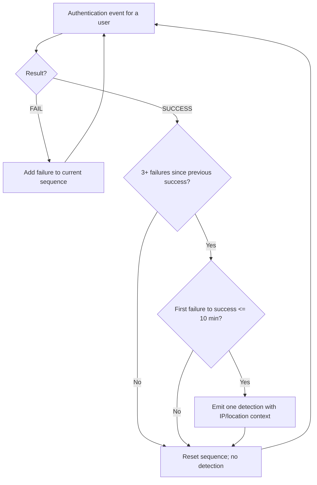
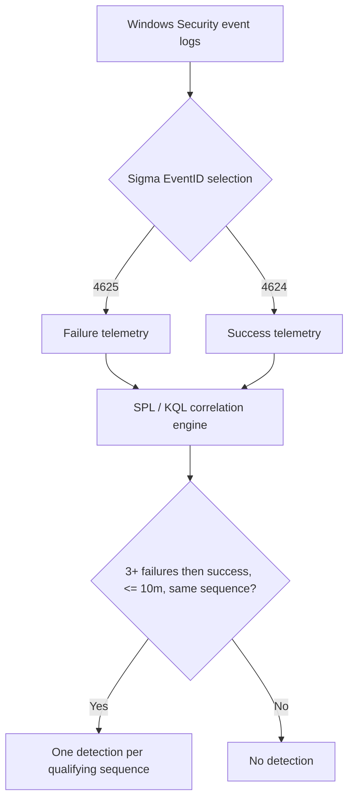

# Detection Research 004 — Failed Logins Followed by Success

## Research question and hypothesis

Can we detect **at least three consecutive failed authentications followed by a successful authentication for the same user within 10 minutes**, without accidentally combining unrelated login attempts or generating repeat detections from the same failures?

The pattern warrants investigation, **not a conclusion of compromise**. Users mistype passwords; services retry; IP addresses and locations can be misleading. Three failures and ten minutes are **lab thresholds**, not production recommendations.

## Detection contract (V4)

A successful login closes the current sequence for that user. Alert only if the sequence contains **three or more failures**, the success occurs **after** those failures, and **first failure → success is at most 10 minutes**. After any success, reset the count. Two distinct qualifying sequences produce two detections; another success without new failures does not.



## How the detection evolved

| Version | Technique | Why we tried it | Problem exposed / tuning decision |
| --- | --- | --- | --- |
| V1 | SPL `stats` / KQL `summarize by User` | Count failures and successes | Counts alone ignore event order; a success *before* failures was incorrectly associated |
| V2 | SPL `transaction maxspan=10m`; KQL `minif/maxif` | Introduce order and bounded grouping | KQL had **no 10-minute limit**; global user aggregation combined independent sequences; `transaction` does not by itself guarantee the intended reset semantics |
| V3 exploration | KQL success-to-failure `join` with a rolling 10-minute filter | Avoid fixed-bucket boundary misses | Multiple successes can reuse the same failures; events before a previous success can leak into the next candidate |
| **V4** | SPL `streamstats` and KQL `row_cumsum` with per-user sequence IDs | Reset after each success, count each sequence once | Current lab implementation; needs execution in actual Splunk/Kusto environments and scale testing |

### Why fixed 10-minute buckets were rejected

`bin(_time,10m)` / `bin(Timestamp,10m)` creates clock-aligned buckets, not rolling windows. A valid sequence at **09:58, 09:59, 10:00, 10:01** crosses a bucket boundary and can be missed.

### Why the sequence reset matters

```text
10:00 FAIL
10:01 FAIL
10:02 SUCCESS   <- only 2 failures: no detection; reset
10:03 FAIL
10:04 FAIL
10:05 FAIL
10:06 SUCCESS   <- 3 failures: one detection; reset
```

For **10:00, 10:02, 10:04 FAIL → 10:05 SUCCESS → 10:06 SUCCESS**, the expected output is **one** detection, not two. Two independent runs of three failures each ending in success should produce **two** detections.

A sequence at **10:00, 10:01, 10:02 FAIL → 10:20 SUCCESS** is not a match: first failure to success is 20 minutes. Exactly 10 minutes **is** included.

## Queries and reasoning

### [SPL V4](detections/failed_logins_followed_by_success.spl)

- `sort 0 user _time`: order each account's events chronologically.
- `eval is_success`: mark success events with 1.
- `streamstats sum(is_success) ... by user`: running number of successes seen for each account.
- `sequence_id=completed_successes-is_success`: place the closing success in the **same** sequence as preceding failures. Subsequent events start a new sequence.
- `stats ... by user sequence_id`: aggregate each sequence, not the whole user's history.
- `where failures>=3 AND successes=1 ... AND success_time-first_failure<=600`: enforce count, order and the inclusive 600-second maximum.
- `values(...)`: retain IP/location context for the analyst. `convert ctime` formats timestamps for display.

**Why not keep `transaction`?** It helped teach event ordering, but the desired explicit reset at every success is easier to audit with a sequence ID. `transaction` can also be resource intensive at scale. A production deployment should benchmark `streamstats`, cardinality and sorting costs.

### [KQL V4](detections/failed_logins_followed_by_success.kql)

- `sort by User, Timestamp | serialize`: provide an ordered rowset for window functions.
- `IsSuccess=toint(...)`: encode a success as 1.
- `row_cumsum(IsSuccess, User != prev(User))`: running success count, reset when the user changes.
- `SequenceId=CompletedSuccesses-IsSuccess`: attach the success to the preceding failures; the next event gets a new ID.
- `summarize ... by User, SequenceId`: equivalent in purpose to SPL `stats BY user sequence_id`.
- `countif`, `minif`, `maxif`, `make_set_if`: conditional counts, boundary timestamps and distinct source context.
- `where SuccessTime - FirstFailure <= 10m`: enforce the inclusive window; comparing **last failure → success** alone would be insufficient.
- `project`: select the output fields, similar to SPL `table`.

**Schema:** `AuthenticationEvents(Timestamp:datetime, User:string, Result:string, SourceIP:string, Location:string)` is a **synthetic teaching schema**. Map real Windows 4624/4625 or Sentinel telemetry to these fields before deployment. These files have **not been executed against Microsoft Sentinel or Splunk** in this update.

## Synthetic test data and evidence

- [Original six-user lab data](test-data/authentication_events.csv) — preserved for V1/V2 history.
- [Nine focused V4 scenarios](test-data/synthetic_authentication_scenarios.csv).
- [Expected detection counts](test-data/expected_results.csv).
- [Executable Python reference model](test-data/test_sequences.py) — run `python test-data/test_sequences.py` from any directory.

| Scenario | Expected detections |
| --- | ---: |
| `three_failures_success` | 1 |
| `below_threshold` | 0 |
| `failures_only` | 0 |
| `success_resets_count` | 1 |
| `outside_ten_minutes` | 0 |
| `crosses_fixed_bucket` | 1 |
| `two_distinct_sequences` | 2 |
| `repeated_success_no_new_failures` | 1 |
| `exact_ten_min_boundary` | 1 |

The expected results define the **intended behaviour**, not verified SPL/KQL outputs. The reference model can be executed locally and is useful for regression testing. **Platform validation remains pending**: import the CSV, run both queries, save actual result tables, and compare the scenario-by-scenario counts. Do not report platform test success until that is done.

## Sigma: telemetry selection versus correlation

[Windows Security event-selection Sigma rule](detections/failed_logins_followed_by_success.yml) selects **4625 (failure)** and **4624 (success)**. It does **not** implement the count, time window, sequence reset or duplicate logic. Those are performed by SPL/KQL.



The earlier README recorded `sigma check` returning **0 errors, 0 condition errors, 0 issues** for the existing rule. **That check was not rerun in this update**. Syntax checking is not behavioural validation.

## Limitations and next validation work

- Same-user correlation does **not** prove that the failed and successful attempts share an attacker. IP/location are context, not hard filters; VPNs, NAT, proxies and geolocation can mislead.
- The **first-failure-to-success** policy intentionally rejects long sequences even if the last three failures occurred within ten minutes. A different threat hypothesis could instead use a rolling subwindow; document that choice before changing it.
- Events with identical timestamps need a stable secondary event ID for deterministic ordering. Late-arriving or missing telemetry can change reconstructed sequences.
- Search-window boundaries may hide earlier failures or successes. Run with enough lookback and define how detections are deduplicated across scheduled executions.
- No logon-type filtering, account allowlists, asset criticality, rate baselines or production thresholds have been tuned yet.
- Sort/window operations may be costly for high-volume data. Benchmark against real workloads.
- The reference test validates the **specification**; it is **not** an execution engine for SPL/KQL. Capture actual platform results and investigate mismatches before calling V4 production-ready.

## Research takeaway

A correct event count is not enough. The **time window**, **event order**, **sequence boundary** and **alert identity** all affect false positives and false negatives. V4 records the reasoning behind each design choice so the detection can be challenged and improved rather than simply copied.
